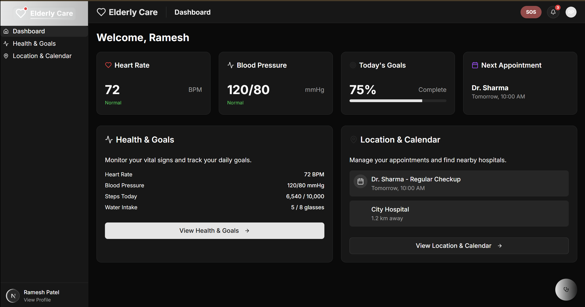
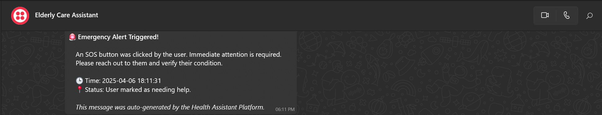
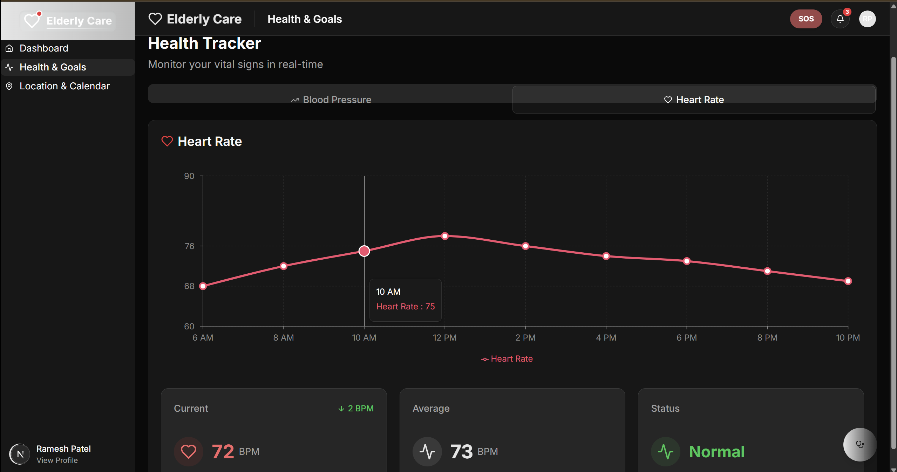
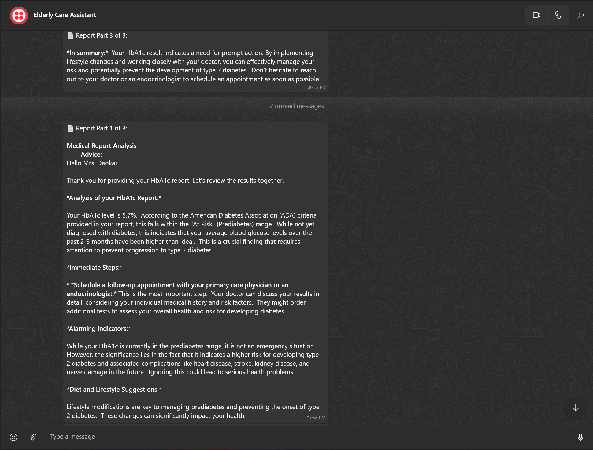
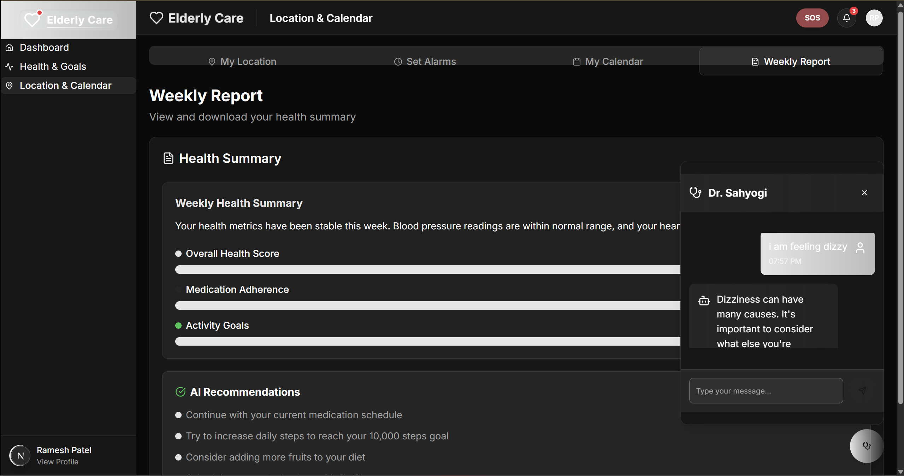

# 🧠 ElderCare AI - Multi-Agent System for Elderly Assistance

## 🚀 Problem Statement

As the global population ages, ensuring the well-being of elderly individuals living independently presents a growing challenge. With limited real-time monitoring, inconsistent health tracking, and emergency risks, elderly individuals often face safety, health, and communication gaps.

## 💡 Solution Overview

**ElderCare AI** is an AI-powered multi-agent system designed to assist elderly individuals in living safely and independently. It combines real-time monitoring, AI health analysis, and wearable integration to create a holistic support system. Our solution is designed not just for the elderly—but for peace of mind for caregivers and families too.

### 🎯 Key Challenges Addressed:
- Inactivity or fall detection in real time
- Lack of immediate emergency response
- Difficulty managing daily health routines and medications
- No centralized health dashboard with wearable integration
- Inaccessible medical data interpretation

### ✅ How We Solve It:

1. **📹 Real-Time Motion Detection**  
   Using CCTV and OpenCV, our system continuously monitors movement. If no motion is detected for a configurable time, a WhatsApp alert is sent to registered family members.

2. **🆘 SOS Emergency Button**  
   A simple UI button that the elderly can press to trigger an SOS alert via Twilio, instantly notifying caregivers.

3. **📄 Medical Report Analyzer (OCR + Gemini RAG)**  
   Users can upload health reports, which are parsed using OCR and passed to a Gemini-powered RAG model trained on medical literature. It generates understandable advice and precautionary steps.

4. **💬 AI Health Chatbot**  
   A memory-aware conversational agent trained with RAG and LangChain that helps users understand symptoms and get book-based medical responses—no misleading AI talk, just helpful health guidance.

5. **⌚ Fitbit Integration**  
   Real-time syncing with Fitbit to show health stats like:
   - Heart rate
   - Steps walked
   - Daily activity trends  
   This is displayed in a dashboard accessible by family and caregivers.

6. **⏰ Reminder & Routine Management**  
   Daily medication, appointments, and routine reminders can be scheduled to assist with self-care and independence.

---

## 🛠️ Technologies Used

| **Python + Flask** | Backend and APIs |
| **OpenCV** | Motion detection via CCTV |
| **Twilio API** | WhatsApp alerts |
| **LangChain + Gemini API** | Chatbot & report analysis |
| **Mistral OCR** | Report data extraction |
| **React.js** | Frontend (Dashboard, Alerts, Chatbot) |
| **FAISS** | Fast vector similarity search for medical documents |
| **Threading & Session Memory** | Agent memory & async behavior |

---

## 🧠 Agent Interaction Design

- **Motion Agent** monitors inactivity → triggers Alert Agent
- **SOS Agent** handles emergency alerts from frontend
- **Medical Analyzer Agent** processes uploaded reports and invokes Gemini RAG
- **Chat Agent** retains session history and uses medical textbook vector search to answer
- **Reminder Agent** schedules notifications 
- **Dashboard Agent** syncs Fitbit data for display

---

## 🧾 Conclusion

ElderCare AI offers a robust, modular, and intelligent solution to support elderly individuals living independently. By combining real-time alerts, AI-driven medical insights, and health monitoring, we ensure safety, peace of mind, and better quality of life—both for the elderly and their families. This solution effectively addresses the hackathon's goal of real-time assistance, health monitoring, and emergency response through a collaborative multi-agentic system.

---

## 📸 UI Screenshots

### 🏠 Home Page  

---

### 🚨 SOS Alert Interface  

---

### 📊 Health Dashboard  

---

### 📄 Medical Report Analyzer  

---

### 💬 Multi-Agent Chatbot  

## 🎥 Demo Video

Watch our full project demo on YouTube to see the system in action:

👉 [Click here to watch the demo](https://youtu.be/v6Va9630I98)
